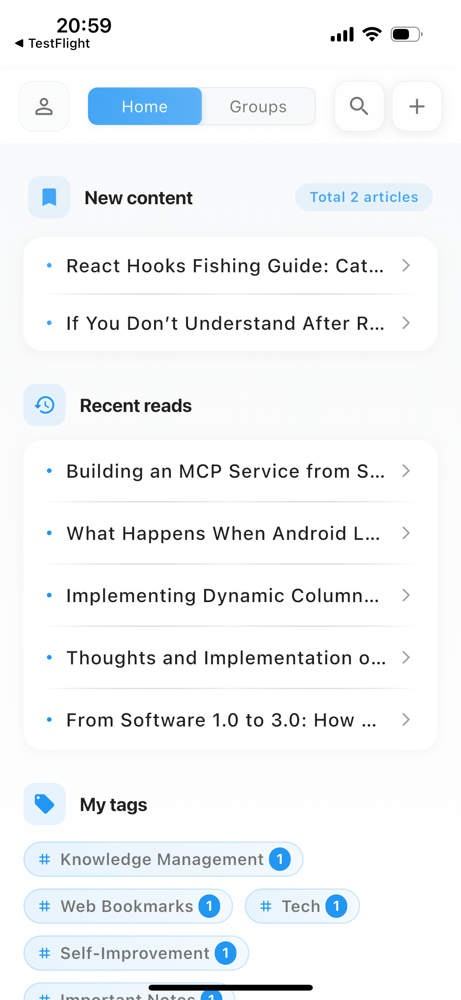
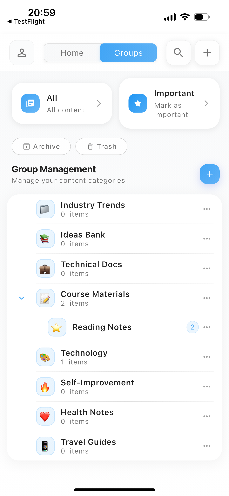

## 📚 项目介绍
Clipora是一款网页书签管理工具，通过系统共享可以将您想收藏的网页自动生成快照、并将快照保存到您本地存储。商业版的同时会将网页文章解析成阅读更友好的Markdown文档。


### 📏 该项目分为商业版与开源版
版本不同之处在于开源的不包含服务端相关的功能。
- 开源版不需要登录，直接跳转到首页。
- 不含将网页解析成Markdown文档。
- 不包含AI翻译功能。
- 不含数据同步功能。


### 💡 Flutter 版本
```shell
> flutter --version
Flutter 3.24.5 • channel stable • https://github.com/flutter/flutter.git
Framework • revision dec2ee5c1f (9 months ago) • 2024-11-13 11:13:06 -0800
Engine • revision a18df97ca5
Tools • Dart 3.5.4 • DevTools 2.37.3 
```

完整版的项目已上线苹果应用商店； 

https://apps.apple.com/us/app/clipora-web-clipper-reader/id6747252007


### ⌨️ 完整版核心功能 

### 1. 网页一键收藏与永久快照
- **轻松剪藏**：通过系统共享，一键即可将感兴趣的网页完整保存。
- **永久存档**：自动为每个收藏的网页生成快照，即使原网页失效或被删除，您也能随时回顾，确保知识永不丢失。
- **离线阅读**：随时随地，即使没有网络也能访问您收藏的所有内容。

### 2. 沉浸式阅读与深度标注
- **纯净阅读**：自动提取网页正文，去除广告和干扰元素，提供沉浸式、无干扰的阅读体验。
- **高亮与批注**：像阅读纸质书籍一样，在网页原文上自由高亮、添加笔记。将您的思考与原文紧密结合，加深理解与记忆。


### 💡Clipora 为您解决的问题

*   **聚合管理**：将散落各处的知识碎片统一管理。
*   **永久保存**：网页快照功能，让您的收藏永不失效。
*   **深度内化**：高亮标注功能，将阅读转化为真正的知识吸收。
*   **无障碍阅读**：AI翻译功能，打破语言壁垒。
*   **极简体验**：追求极致简约的设计，您可以根据需要配置阅读主题，打造最适合自己的阅读体验。


|                          ·                           |                          ·                           |
|:----------------------------------------------------:|:----------------------------------------------------:|
|  |  
