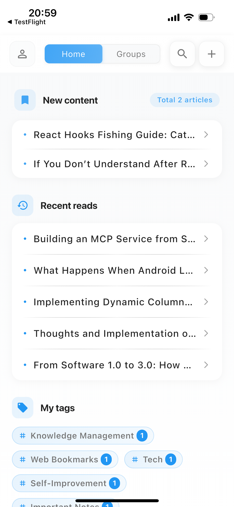
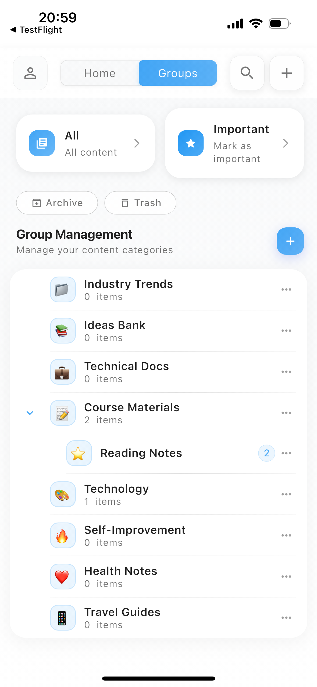

# Clipora

[English](README.md) | [中文](README-CN.md)

A powerful web bookmark management tool built with Flutter that automatically generates snapshots of web pages and saves them to local storage.

[](https://flutter.dev/)
[](LICENSE)
[](https://apps.apple.com/us/app/clipora-web-clipper-reader/id6747252007)

## 📚 About

Clipora is a web bookmark management tool that automatically generates snapshots of web pages you want to bookmark through system sharing and saves these snapshots to your local storage. The commercial version also parses web articles into more reader-friendly Markdown documents.

## ✨ Features

### Open Source Version

- 📱 WCross-platform support (iOS/Android)
- 📄 Web page snapshot generation
- 💾 Loscal storage management
- 🔄 System sharing integration
- 🎨 Customizable reading themes

### Commercial Version (App Store)

- 🔐 Usetr authentication and sync
- 📝 Markdown document parsing
- 🌐 AI translation functionality
- ☁️ Data synchronization across devices

## 🚀 Quick Start

### Prerequisites

- Flutter 3.24.5 or higher
- Dart 3.5.4 or higher
- iOS 12.0+ / Android API 21+

### Installation

1. Clone the repository:

```bash
git clone https://github.com/qq337196325/Clipora.git
cd Clipora
```

2. Install dependencies:

```bash
flutter pub get
```

3. Run the app:

```bash
flutter run
```

## 🛠 Development Environment

```shell
> flutter --version
Flutter 3.24.5 • channel stable • https://github.com/flutter/flutter.git
Framework • revision dec2ee5c1f (9 months ago) • 2024-11-13 11:13:06 -0800
Engine • revision a18df97ca5
Tools • Dart 3.5.4 • DevTools 2.37.3 
```

## 📱 Download

The complete version is available on the App Store:

[](https://apps.apple.com/us/app/clipora-web-clipper-reader/id6747252007)

## ⌨️ Core Features (Commercial Version)

### 1. One-Click Web Page Collection and Permanent Snapshots

- **Easy Clipping**: Through system sharing, you can save interesting web pages completely with one click.
- **Permanent Archive**: Automatically generates snapshots for each bookmarked web page. Even if the original web page becomes invalid or is deleted, you can review it at any time, ensuring knowledge is never lost.
- **Offline Reading**: Access all your bookmarked content anytime, anywhere, even without an internet connection.

### 2. Immersive Reading and Deep Annotation

- **Clean Reading**: Automatically extracts web page content, removes ads and distracting elements, providing an immersive, distraction-free reading experience.
- **Highlighting and Annotation**: Like reading physical books, freely highlight and add notes on the original web page text. Closely combine your thoughts with the original text to deepen understanding and memory.

## 💡 Problems Clipora Solves for You

- **Aggregated Management**: Unified management of knowledge fragments scattered everywhere.
- **Permanent Storage**: Web page snapshot functionality ensures your bookmarks never expire.
- **Deep Internalization**: Highlighting and annotation features transform reading into genuine knowledge absorption.
- **Barrier-Free Reading**: AI translation functionality breaks down language barriers.
- **Minimalist Experience**: Pursuing extremely simple design, you can configure reading themes according to your needs to create the most suitable reading experience for yourself.

## 📸 Screenshots

|                             ·                              |                             ·                              |
| :--------------------------------------------------------: | :--------------------------------------------------------: |
|  |  |

## 📄 License

This project is licensed under the MIT License - see the [LICENSE](LICENSE) file for details.

## 🤝 Contributing

Contributions are welcome! Please feel free to submit a Pull Request.
